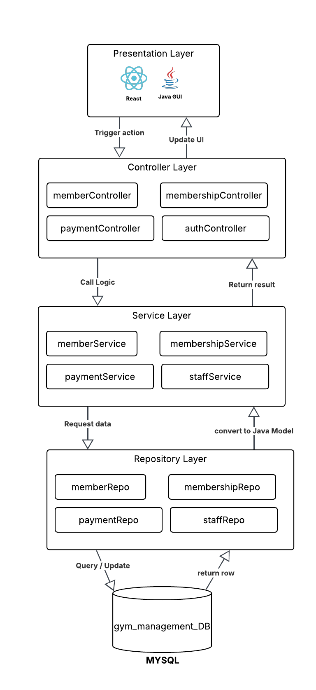
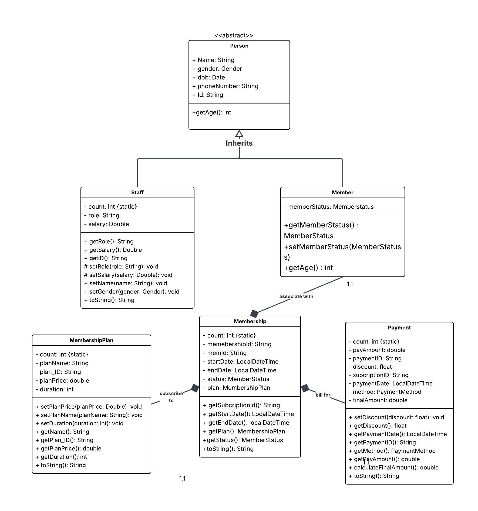
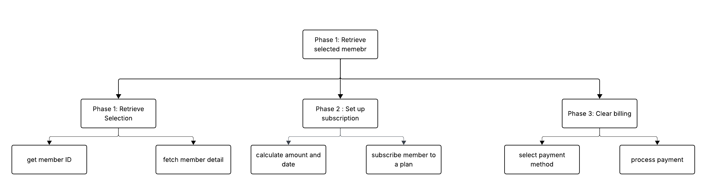
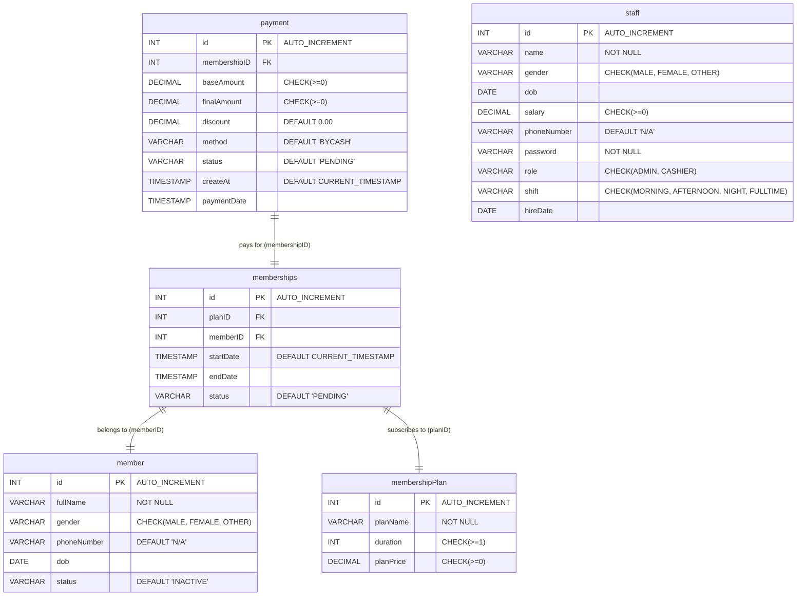

# Gym Management System

A Java-powered backend REST service and desktop application for managing gym memberships, subscribers, pricing plans, staff accounts, and billing transactions.

---

## Team Members

- Ly Serakyuth
- Bauch Sacara
- Iem Sievinh
- Teng Mouykim

---

## Table of Contents

- [Team Members](#team-members)
- [Overview](#overview)
- [Prerequisites](#prerequisites)
- [System Diagrams](#system-diagrams)
  - [Tier Architecture Diagram](#tier-architecture-diagram)
  - [Class Diagram](#class-diagram)
  - [Stepwise Workflow Diagram](#stepwise-workflow-diagram)
  - [Database ER Diagram](#database-er-diagram)
- [Getting Started](#getting-started)
  - [1. Database Configuration](#1-database-configuration)
  - [2. Build & Run Application](#2-build--run-application)
- [Project Architecture](#project-architecture)

---

## Overview

This project provides the Java backend REST API server (built with Javalin) and desktop GUI (built with Java Swing) for the Gym Management System. It handles database persistence, business validation, member registrations, and payment transaction processing.

---

## Prerequisites

- **JDK 17+**: Java Development Kit to compile and run the backend application
- **Apache Maven**: Dependency management and build tool (`mvn`)
- **Javalin**: Lightweight Java REST API framework
- **MySQL Server**: Relational database engine (`gym_db` on default port `3306`)

---

## System Diagrams

### Tier Architecture Diagram


### Class Diagram


### Stepwise Workflow Diagram


### Database ER Diagram


---

## Getting Started

### 1. Database Configuration

1. **Create the database in MySQL**:
   ```sql
   CREATE DATABASE gym_db;
   ```

2. **Configure Credentials**:
   Update `src/main/resources/db.properties` with your database credentials:
   ```properties
   db.url = jdbc:mysql://localhost:3306/gym_db
   db.user = YOUR_MYSQL_USERNAME
   db.password = YOUR_MYSQL_PASSWORD
   ```
   *(Tables will be created automatically by `DatabaseInitializer` on startup.)*

---

### 2. Build & Run Application

#### Option A: Running with Maven (Native)

1. **Clone the repository**:
   ```bash
   git clone https://github.com/Brotheryuth/Gym-Management-System.git
   cd Gym-Management-System
   ```

2. **Compile project and download dependencies**:
   ```bash
   mvn clean compile
   ```

3. **Start Application**:
   ```bash
   mvn exec:java
   ```

#### Option B: Running with Docker

1. **Build the Docker Image**:
   ```bash
   docker build -t gym-management .
   ```

2. **Run the Container**:
   ```bash
   docker run -p 7070:7070 gym-management
   ```

---

## Project Architecture

- **Model Layer (`com.gym.model`)**: Domain data structures (`Member`, `Membership`, `Payment`, `Staff`, etc.).
- **Repository Layer (`com.gym.repository`)**: Direct SQL queries and JDBC database access.
- **Service Layer (`com.gym.service`)**: Business logic, date validation, and payment processing rules.
- **Controller Layer (`com.gym.controller`)**: Javalin REST API routes for external web clients.
- **GUI Layer (`com.gym.gui`)**: Swing desktop views and cashier terminal dialogs.
